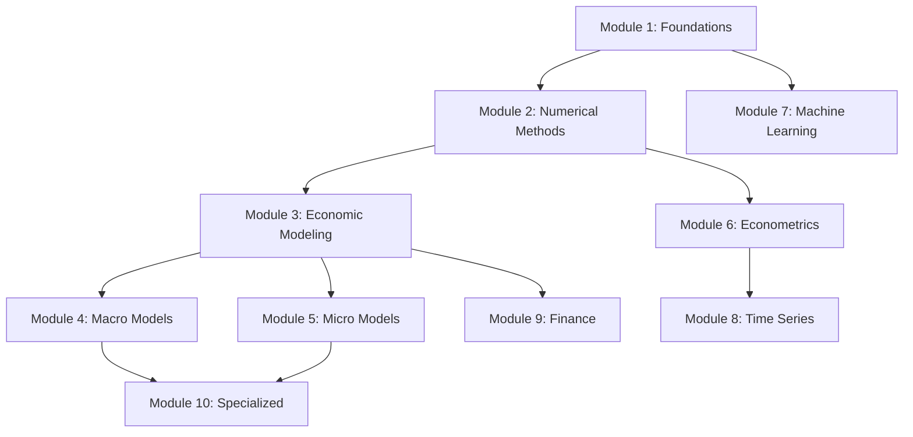

# All Modules

Explore the complete curriculum of the Computational Economics and Data Science course.

---

## Course Structure

The course is organized into **10 comprehensive modules** covering everything from Python fundamentals to frontier research methods.

---

## Foundation Modules

### [:material-rocket: Module 1: Foundations](01-foundations/index.md)
**Duration:** 4-6 weeks | **24 notebooks** | **Beginner**

Python programming, NumPy, Pandas, data visualization, APIs, and professional development tools.

**Topics:** Python fundamentals, scientific computing, data acquisition, visualization, debugging

---

### [:material-calculator: Module 2: Numerical Methods](02-numerical-methods/index.md)
**Duration:** 3-4 weeks | **8 notebooks** | **Intermediate**

Computational algorithms for solving economic problems numerically.

**Topics:** Linear algebra, optimization, root-finding, interpolation, integration, differential equations

---

### [:material-chart-line: Module 3: Economic Modeling](03-economic-modeling/index.md)
**Duration:** 3-4 weeks | **7 notebooks** | **Intermediate**

Core frameworks for computational economics and dynamic optimization.

**Topics:** Dynamic programming, value iteration, policy iteration, continuous states, calibration

---

## Macroeconomics Modules

### [:material-building-columns: Module 4: Macro Models](04-macro-models/index.md)
**Duration:** 4-5 weeks | **7 notebooks** | **Advanced**

Computational macroeconomic theory and applications.

**Topics:** Job search, growth models, RBC, OLG, New Keynesian, HANK, endogenous growth

---

## Microeconomics Modules

### [:material-users: Module 5: Micro Models](05-micro-models/index.md)
**Duration:** 3-4 weeks | **6 notebooks** | **Advanced**

Computational microeconomic theory and game theory.

**Topics:** Consumer/producer theory, general equilibrium, game theory, discrete choice, contracts

---

## Econometrics & Statistics

### [:material-chart-bar: Module 6: Econometrics](06-econometrics/index.md)
**Duration:** 5-6 weeks | **12 notebooks** | **Intermediate to Advanced**

Modern econometric methods and causal inference.

**Topics:** OLS, MLE, causal inference, GMM, IV, RDD, synthetic control, DiD, Bayesian, panel data

---

### [:material-clock: Module 8: Time Series](08-time-series/index.md)
**Duration:** 3-4 weeks | **6 notebooks** | **Advanced**

Time series econometrics and forecasting.

**Topics:** ARMA, ARIMA, VAR, GARCH, cointegration, VECMs

---

## Machine Learning

### [:material-brain: Module 7: Machine Learning](07-machine-learning/index.md)
**Duration:** 6-8 weeks | **25 notebooks** | **Intermediate to Advanced**

Comprehensive machine learning for economists, from classical methods to deep learning.

**Topics:** ML fundamentals, gradient boosting, SVM, deep learning, CNNs, RNNs, transformers, reinforcement learning, causal ML, NLP, GNNs

---

## Finance

### [:material-money-bill-trend-up: Module 9: Finance](09-finance/index.md)
**Duration:** 3-4 weeks | **7 notebooks** | **Advanced**

Computational methods in finance and asset pricing.

**Topics:** Portfolio theory, asset pricing, option pricing, continuous-time finance, credit risk, high-frequency data

---

## Advanced Topics

### [:material-network-wired: Module 10: Specialized Models](10-specialized/index.md)
**Duration:** 2-3 weeks | **3 notebooks** | **Advanced**

Cutting-edge computational methods for economics.

**Topics:** Agent-based models, heterogeneous agents, network economics

---

## Appendices

### [:material-book-open-variant: Mathematical Foundations](../appendices/index.md)

Rigorous mathematical background for the course.

**Topics:** Real analysis, multivariate calculus, probability theory, linear algebra

---

## Course Progression

### Recommended Path

### Alternative Paths

=== "Theory-Focused"
    1. Foundations → Numerical Methods → Economic Modeling
    2. Macro Models → Micro Models → Finance
    3. Specialized Models

    **Best for:** Economics PhD students

=== "Applied/Empirical"
    1. Foundations → Econometrics → Time Series
    2. Machine Learning → Causal ML
    3. Applied projects

    **Best for:** Data scientists, applied economists

=== "Finance-Focused"
    1. Foundations → Numerical Methods
    2. Econometrics → Time Series
    3. Finance → Portfolio projects

    **Best for:** Quantitative finance professionals

---

## Difficulty Progression

| Module | Difficulty | Prerequisites |
|--------|-----------|---------------|
| 1: Foundations | ⭐ Beginner | None |
| 2: Numerical Methods | ⭐⭐ Intermediate | Module 1 |
| 3: Economic Modeling | ⭐⭐ Intermediate | Modules 1-2 |
| 6: Econometrics | ⭐⭐ Intermediate | Modules 1-2 |
| 7: Machine Learning | ⭐⭐⭐ Intermediate-Advanced | Modules 1-2 |
| 4: Macro Models | ⭐⭐⭐ Advanced | Modules 1-3 |
| 5: Micro Models | ⭐⭐⭐ Advanced | Modules 1-3 |
| 8: Time Series | ⭐⭐⭐ Advanced | Modules 1-2, 6 |
| 9: Finance | ⭐⭐⭐ Advanced | Modules 1-3 |
| 10: Specialized | ⭐⭐⭐⭐ Advanced | Modules 1-5 |

---

## Total Course Statistics

- **116 Jupyter notebooks**
- **10 core modules** + appendices
- **300+ hours** of content
- **50+ datasets** included
- **100+ diagrams and visualizations**

---

## Get Started

Ready to begin your journey?

[:material-download: Install & Setup](../getting-started/installation.md){ .md-button .md-button--primary }
[:material-rocket-launch: Quick Start](../getting-started/quickstart.md){ .md-button }
[:material-school: Module 1: Foundations](01-foundations/index.md){ .md-button }
