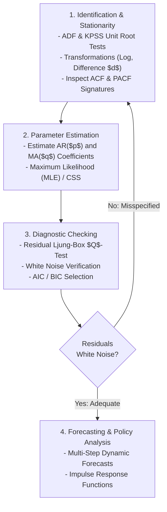

# Box-Jenkins Time Series Iterative Methodology

Four-stage iterative workflow for ARIMA/SARIMA model identification, estimation, diagnostic checking, and forecasting.

```mermaid
flowchart TD
    A["1. Identification & Stationarity<br/>- ADF & KPSS Unit Root Tests<br/>- Transformations (Log, Difference $d$)<br/>- Inspect ACF & PACF Signatures"] --> B["2. Parameter Estimation<br/>- Estimate AR($p$) and MA($q$) Coefficients<br/>- Maximum Likelihood (MLE) / CSS"]
    B --> C["3. Diagnostic Checking<br/>- Residual Ljung-Box $Q$-Test<br/>- White Noise Verification<br/>- AIC / BIC Selection"]
    C --> D{"Residuals<br/>White Noise?"}
    D -->|No: Misspecified| A
    D -->|Yes: Adequate| E["4. Forecasting & Policy Analysis<br/>- Multi-Step Dynamic Forecasts<br/>- Impulse Response Functions"]
```
