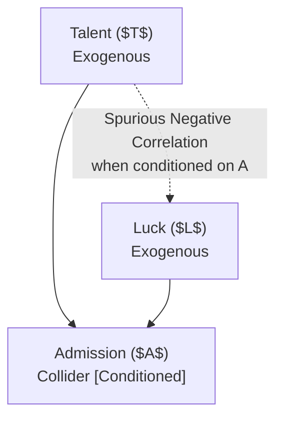

# Collider Bias DAG (Berkson's Paradox)

Conditioning on a common collider outcome creates spurious negative correlation between independent causes.

```mermaid
flowchart TD
    T["Talent ($T$)<br/>Exogenous"] --> A["Admission ($A$)<br/>Collider [Conditioned]"]
    L["Luck ($L$)<br/>Exogenous"] --> A
    T -.->|Spurious Negative Correlation<br/>when conditioned on A| L
```
