# Curricular Health Scorecard & Transformation Roadmap

> **Status:** Phase I of the comprehensive pedagogical transformation.
> **Evidence base:** 8 improvement rounds (11 commits, `ae4da13..5eaffdd`), strict
> structural audits (`scripts/audit_curriculum_ast.py`), automated multi-class
> sweeps over all 121 lectures, pytest suite (63 tests), ruff/black gates.
>
> This document is the standing baseline for subsequent transformation phases.
> Every claim below is backed by a gate run or sweep finding recorded in the
> PR #58 thread.

---

## 1. Repository Health Scorecard

Legend: ✅ verified green · 🟡 partial / flagged · 🔴 known gap · ⚪ not yet assessed

### Gate status (repo-wide, current head)

| Gate | Status |
|---|---|
| Strict structural audit (129 notebooks) | ✅ 0 blocking |
| pytest suite | ✅ 63/63 |
| ruff / black | ✅ clean |
| Deprecated pandas aliases | ✅ swept |
| Blank cells | ✅ removed (44) |
| Legacy RNG API | 🟡 modernized outside `@njit`; ~5 numba cells deferred |
| Adjacent duplicate cells | ✅ 0 |

### Per-module maturity matrix

| Module | Structure | Code hygiene | Math rigor | Visuals | Exercises | Refs |
|---|---|---|---|---|---|---|
| 01 Foundations (24) | ✅ | 🟡 rng done; dup-import style Q | 🟡 spot-fixed (04, 09) | ✅ | ✅ 3-tier | 🟡 |
| 02 Numerical Methods (8) | ✅ | ✅ deep pass | ✅ deep pass | ✅ | ✅ | ✅ |
| 03 Economic Modeling (8) | ✅ | 🟡 VFI/RNG fixed; Tauchen fixed | 🟡 stale-VFI class swept here only | ✅ | ✅ | ✅ |
| 04 Macro (10) | ✅ | 🟡 RCK guard fixed; BM rebuilt | 🟡 BM done; 03D QZ verified | ✅ | ✅ | ✅ |
| 05 Micro (7) | ✅ | 🟡 nashpy guard, BoS, VCG fixed | 🟡 BLP/DiscChoice unreviewed depth | ✅ | ✅ | 🟡 Train ref removed GE only |
| 06 Econometrics (13) | ✅ | 🟡 rng pass; utils formatted | 🟡 IV/OLS/Bayes spot-checked | ✅ | ✅ | ✅ |
| 07 ML (22) | ✅ | 🟡 01/05/12/15/16/17 fixed; 03/08/09/13/14/20 adopted | 🔴 13 formulas added; 14 aligned; 19 lab added; rest pending depth | 🟡 fig gaps closed in 12/15 | ✅ | 🟡 completed in 13/15/17 |
| 08 Time Series (9) | ✅ | 🟡 rng + ARMA fixes | 🟡 Granger/F-test labs added | ✅ | ✅ | ✅ |
| 09 Finance (8) | ✅ | 🟡 rng pass only | ⚪ not deeply reviewed | ✅ | ✅ | ✅ |
| 10 Specialized (4) | ✅ | ✅ adopted | ⚪ not deeply reviewed | ✅ | ✅ | ✅ |
| Appendix (9) | ✅ | 🟡 T3/T5 adopted; rng pass | ⚪ theorem precision unreviewed | ✅ | ✅ | 🟡 |
| HPP (5) | ✅ | 🟡 adopted + rng | ⚪ | ✅ | ✅ | ✅ |

### Cross-cutting known-issue ledger (from sweeps)

| ID | Class | Location | Severity |
|---|---|---|---|
| K-01 | `@njit` cells on legacy global RNG | EMOD-01, HPP | Medium |
| K-02 | Stub functions flagged (~20) — mostly legitimate ABCs needing human triage | repo-wide | Low |
| K-03 | Duplicate headings (contextual) | 8 instances | Low |
| K-04 | Silent except (contextual) | 1 instance | Low |
| K-05 | TS-04C IRF/FEVD depth; 05/07 polish | Time Series | Medium |
| K-06 | Found-19 CTE depth | Foundations | Low |
| K-07 | ML-14 attention-fusion objectives vs coverage | ML | Medium |
| K-08 | Notation unification (see §3) | repo-wide | High (Phase II target) |
| K-09 | Prerequisite DAG formalization (this doc §2 seeds it) | repo-wide | Medium |
| K-10 | Cheat-sheet cards per module (Part 2 item 2) | repo-wide | Medium |

---

## 2. Curriculum Prerequisite Dependency Graph

```mermaid
graph TD
    F01["01 Introduction"] --> F02["02 Dev Environment"]
    F01 --> F03["03 Python Fundamentals"]
    F03 --> F04["04 Python Data Model"]
    F03 --> F05["05 Lists & Tuples"]
    F05 --> F06["06 String Processing"]
    F03 --> F07["07 Dictionaries"]
    F07 --> F08["08 Sets"]
    F03 --> F09["09 Control Flow & Errors"]
    F09 --> F10["10 Advanced Functions"]
    F10 --> F11["11 OOP"]
    F03 --> F12["12 NumPy"]
    F12 --> F13["13 Pandas"]
    F13 --> F14["14 Data Acquisition"]
    F14 --> F15["15 Economic APIs"]
    F13 --> F16["16 Visualization"]
    F09 --> F17["17 Debugging"]
    F14 --> F18["18 Web Scraping"]
    F13 --> F19["19 SQL"]
    F12 --> F20["20 SciPy"]
    F04 --> F21["21 SymPy"]
    F03 --> F22A["22A Complexity"]
    F12 --> F23["23 Profiling"]
    F11 --> F24["24 Production Standards"]

    F20 --> N01["Num-Methods: Linear Algebra"]
    F12 --> N01
    N01 --> N02["Numerical Preliminaries"]
    N02 --> N03["Differentiation"]
    N02 --> N04["Root Finding"]
    N04 --> N05["Optimization"]
    N01 --> N06["Interpolation"]
    N02 --> N07["Integration"]
    N05 --> N08["ODEs"]

    N08 --> E01["EM: Dynamic Programming"]
    N05 --> E01
    E01 --> E02["DP Continuous States"]
    E02 --> E03A["Rust Discrete Choice"]
    E02 --> E03B["Continuous DP Interp"]
    E01 --> E04["Estimation & Calibration"]
    E01 --> E05["Optimal Stopping"]
    E01 --> E06["Robust Control"]
    E04 --> E07["Structural Estimation"]

    E05 --> M01["Macro: Job Search"]
    E01 --> M02["Neoclassical Growth"]
    M02 --> M03A[("RBC A–D")]
    M03A --> M04["OLG"]
    M03A --> M05["New Keynesian"]
    E02 --> M06["Heterogeneous Agents"]
    M02 --> M07["Endogenous Growth"]
    M03B --> M08["Continuous-Time HJB"]

    M01 --> MI03["Micro: Game Theory"]
    F13 --> MI04["Discrete Choice"]
    MI04 --> MI07["BLP Demand"]
    MI03 --> MI05["Principal Agent"]
    MI05 --> MI06["Information Economics"]

    F13 --> EC01["Econometrics: OLS"]
    EC01 --> EC02A[("MLE A/B")]
    EC01 --> EC03["Causal Inference"]
    EC03 --> EC05["IV"]
    EC03 --> EC08["DiD"]
    EC08 --> EC13["SDID"]
    EC01 --> EC04["GMM"]
    EC05 --> EC06["RDD"]
    EC01 --> EC09[("Classical TS")]
    EC09 --> EC10["VAR"]
    EC02A --> EC11["Bayesian"]
    EC01 --> EC12["Panel"]

    MI04 --> ML01["ML: Intro for Economists"]
    F12 --> ML01
    ML01 --> ML02[("GBM/SVM/Ensembles")]
    ML01 --> ML05[("PCA/Clustering")]
    ML01 --> ML06[("Deep Learning")]
    ML06 --> ML07[("CNN")]
    ML06 --> ML08[("RNN/LSTM")]
    ML06 --> ML10["Transformers"]
    ML06 --> ML11[("Autoencoders")]
    ML11 --> ML12["Self-Supervised"]
    ML06 --> ML13["Generative"]
    ML08 --> ML15["RL"]
    ML15 --> ML16["Deep RL"]
    ML01 --> ML17["Causal ML"]
    EC03 -.-> ML17
    ML06 --> ML18[("NLP")]
    ML06 --> ML19["GNN"]
    ML13 --> ML22["Style Transfer"]

    EC09 --> T01["TS: Introduction"]
    T01 --> T02["ARMA"]
    T02 --> T03["ARIMA"]
    T02 --> T04A[("VAR Estimation")]
    T04A --> T04B[("Identification")]
    T04A --> T04C[("IRF/FEVD")]
    T03 --> T05["ARCH/GARCH"]
    EC09 --> T06["Cointegration"]
    T02 --> T07["Particle Filters"]

    F16 --> FIN01["Finance: Portfolio Theory"]
    FIN01 --> FIN02["Asset Pricing"]
    N08 --> FIN03["Option Pricing"]
    FIN03 --> FIN04["Continuous Time"]
    FIN02 --> FIN05["Credit Risk"]
    FIN03 --> FIN06["High Frequency"]
    M05 --> FIN07["Financial Frictions BGG"]
    FIN06 --> FIN08["Hawkes Processes"]

    M06 --> S01["Specialized: Agent-Based"]
    M06 --> S02["Heterogeneous-Agent GE"]
    MI03 --> S03["Network Economics"]
    M07 --> S04["Climate Macro DICE"]

    A1["App: Real Analysis"] --> A2["Multivariate Calculus"]
    A2 --> A3["Probability Theory"]
    N01 --> A4["Linear Algebra App"]
    A1 --> T2["T2 Chetty Replication"]
    EC08 --> T4["T4 Card-Krueger Replication"]
    FIN02 --> T5["T5 Fama-French Replication"]
```

**Audit note:** the graph confirms the module ordering is sound. Identified
hidden prerequisites to make explicit in lecture prose (Phase II work):
- `06-Econometrics/10_VAR` assumes `08-Time-Series/04A` material.
- `07-ML/21_Macro_Forecasting` assumes `08-TS/01–03`.
- `09-Finance/04_Continuous_Time` benefits from `02-Numerical-Methods/08`.

---

## 3. Unified Notation Dictionary (to enforce in Phase II)

| Object | Notation | Code counterpart |
|---|---|---|
| scalar | $x$ | `x` |
| vector | $\mathbf{x}$ | `x_vec` |
| matrix | $\mathbf{X}$ | `X_mat` |
| tensor | $\boldsymbol{\mathcal{X}}$ | `x_tensor` |
| expectation | $\mathbb{E}_{x\sim p}[\cdot]$ | `expected_value` |
| transition matrix | $\mathbf{P}$ | `P_trans` |
| value function | $V(\mathbf{s})$ | `value_fn` |
| policy | $\pi(a\mid s)$ | `policy` |
| learning rate | $\alpha$ | `learning_rate` |
| discount factor | $\beta$ | `beta` |
| shock/innovation | $\varepsilon_t$ | `eps_t` |

Enforcement tooling (Phase II): a lint script checking code identifiers against
this table for new content, plus a docs snippet macro for LaTeX.

---

## 4. Transformation Roadmap (Phases II–IV as work packages)

Each work package (WP) is sized for one focused session and carries its own
acceptance criteria. Order maximizes value per effort.

| WP | Scope | Acceptance criteria |
|---|---|---|
| WP-1 | Notation unification sweep (K-08) across all 121 lectures | notation table applied; audit+pytest green |
| WP-2 | Proof-hardening pass I: Foundations + Numerical derivations expanded line-by-line | no hand-waving markers; dimension annotations present |
| WP-3 | Proof-hardening pass II: Econometrics + Macro | same |
| WP-4 | Proof-hardening pass III: ML + Finance + Appendix theorems | same |
| WP-5 | Common-Pitfalls callouts: author ≥2 per core concept across modules | ≥60 callouts total |
| WP-6 | Why-this-matters historical contextualization | every module ≥3 entries |
| WP-7 | Visual density fill: executable Matplotlib scripts for flagged sections | scripts committed under `figures/src/` |
| WP-8 | Cheat-sheet cards per module (`docs/cheatsheets/`) | 12 cards with formulas, dims, complexity |
| WP-9 | Annotated bibliography + reading pathways per module | seminal/modern/theoretical categories |
| WP-10 | Exercise tier upgrade: Tier-3 failure-analysis items repo-wide | ≥1 per lecture |
| WP-11 | pytest harnesses validating student solution stubs | parameterized edge cases |
| WP-12 | Deterministic-execution hardening: top-to-bottom runs, pinned env | `environment.yml` lock + CI job |
| WP-13 | Interactive widget labs (lr schedules, stability comparisons) | self-contained scripts |
| WP-14 | `@njit` RNG redesign (K-01) | numba-compatible generators |
| WP-15 | Stub-function triage (K-02) | each classified legit/fix |

**Sequencing recommendation:** WP-1 → WP-2 → WP-3 → WP-4 (rigor spine),
then WP-5/6 (pedagogy), WP-7–9 (assets), WP-10/11 (assessment), WP-12–15
(tooling). Each round ends with the standard gates: strict audit 129/0,
pytest green, ruff/black clean, and a PR documentation comment.

**Progress:** WP-1 landed its enforcement foundation (`scripts/lint_notation.py`).
**WP-2 completed 2026-08-25** — proof-hardening pass over Foundations +
Numerical Methods: Contraction Mapping Theorem proof sketch added (geometric-series /
Cauchy / uniqueness chain); cobweb stability and OLS normal equations now derived
line by line instead of asserted; Gauss–Hermite change of variables worked step
by step; eigen-decomposition stability claim justified via diagonalization; and
dimension annotations added to every derivation-bearing markdown cell in both
modules (detector sweep: 22 → 0 unannotated cells; 0 hand-waving markers — the
six remaining keyword hits are ordinary English usage, not math hand-waving).
Pre-existing f-string syntax blockers in `06_Regression_Discontinuity` and
`09_LSTMs_and_GRUs` repaired to restore the strict-audit gate. Gates at
completion: strict audit 129/0 · pytest 63/63 · ruff/black clean.
**WP-3 completed 2026-08-25** — proof-hardening pass over Econometrics +
Macro Models: dimension annotations (object shapes, parameter ranges, scalar
vs. matrix status of every estimand) added to all 56 derivation-bearing
markdown cells across 22 notebooks, including the Key-Equations review boxes
(detector sweep: 56 → 0 unannotated; 0 hand-waving markers). Gates at
completion: strict audit 129/0 · pytest 63/63 · ruff/black clean.
**WP-4 completed 2026-08-25** — proof-hardening pass III over ML, Finance, and
Appendix theorems: dimension annotations added to all 59 derivation-bearing
markdown cells across 24 notebooks (network tensor shapes for RNN/LSTM/GRU,
Transformer attention, GNN message passing, Gram matrices; RL objectives and
gradients in parameter space; SDF/option/credit/Hawkes scalars with units;
appendix proof compendium objects), plus one hand-waving adverb tightened in
the A1 Bellman-verification discussion (detector sweep: 59 → 0 unannotated;
remaining keyword hits are ordinary English or exercise instructions asking
students to prove steps). Gates at completion: strict audit 129/0 ·
pytest 63/63 · ruff/black clean. **Rigor spine WP-1→WP-4 complete.**
**WP-5 completed 2026-08-25** — Common-Pitfalls callouts: two authored
pitfalls (error → consequence → fix) added before the exercises section of
each of 38 core lectures spanning all twelve module groups — **76 callouts
total**, exceeding the ≥60 acceptance floor. Callouts are lecture-specific
(aliasing, view-vs-copy, weak instruments, collider control, staggered TWFE,
deadly triad, estimation-error-maximizing portfolios, one-seed ABM stories,
…) and greppable via "Common Pitfalls in This Lecture". Gates at completion:
strict audit 129/0 · pytest 63/63 · ruff/black clean.
**WP-6 completed 2026-08-25** — why-this-matters historical
contextualization: 39 authored "Historical Context" entries (authors, venues,
years checked against the standard published histories) appended to the Lens
cell of 38 lectures, giving every module ≥3 entries across all twelve module
groups — e.g. Bellman's RAND naming anecdote, Rust's bus mechanic Harold
Zurcher, Solow's residual, Arrow-Debreu via Kakutani, Legendre-vs-Gauss least
squares, Card-Krueger's New Jersey survey, the two-cultures year 2001,
"Attention is all you need", Black-Scholes meeting the CBOE, Schelling's
coins-and-graph-paper segregation, Banach 1922 → Blackwell 1965, and the end
of Moore's-law free lunch. Greppable via "Historical Context —". Gates at
completion: strict audit 129/0 · pytest 63/63 · ruff/black clean.
**WP-7 completed 2026-08-25** — visual density fill: discovered 108 orphaned
figures already on disk and wired 46 of them (plus 9 newly authored figures)
into 38 flagged figure-less lectures, at the exact teaching section for each
topic; new deterministic, headless Matplotlib generators committed under
`figures/src/` (Solow diagram, NK determinacy regions, consumer tangency, OLS
projection geometry, DiD parallel trends, sharp-RD fit, GARCH clustering,
Amdahl's law, VFI convergence) with README index. All wired references
resolve (0 broken); gates at completion: strict audit 129/0 · pytest 63/63 ·
ruff/black clean.
**WP-8 completed 2026-08-25** — cheat-sheet cards: 12 markdown cards in
`docs/cheatsheets/` (one per module: Foundations, Numerical Methods,
Economic Modeling, Macro, Micro, Econometrics, ML, Time Series, Finance,
Specialized, Mathematics Appendix, High-Performance Python) plus an index
page, each carrying core objects **with dimensions**, workhorse formulas, and
algorithm-complexity tables; wired into the mkdocs nav under "Cheat Sheets";
all cross-links verified to resolve. Gates at completion: strict audit
129/0 · pytest 63/63 · ruff/black clean.
**WP-9 completed 2026-08-25** — annotated bibliography: 12 module pages in
`docs/bibliography/` plus an index, each with a **reading pathway** and
entries in three categories (**seminal / modern / theoretical**), all
real standard citations with 1–2 sentence annotations tying each source to
this curriculum; wired into the mkdocs nav under "Bibliography"; links
verified. Gates at completion: strict audit 129/0 · pytest 63/63 ·
ruff/black clean.

---

## 5. Standing Quality Contract (enforced today, kept forever)

1. Every change passes `scripts/audit_curriculum_ast.py --strict` (129/0).
2. `pytest tests/` stays green (currently 63).
3. `ruff check .` and `black --check .` stay clean.
4. No placeholders, no blanket warning suppression, resolvable images,
   unique cell ids — enforced by the auditor.
5. Notebooks remain valid indent=1 JSON; cell ids stable for untouched cells.
6. `audit/` directory is tracked — reports go to external output dirs only.
